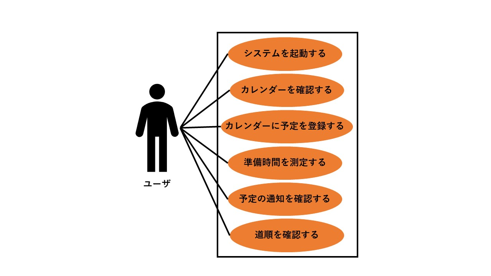
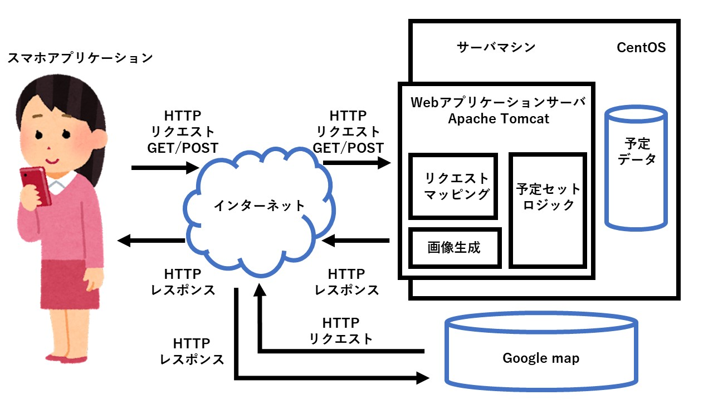

# Number_one

# 第 1 回　 6/12

チーム 1 チーム名「ナンバーワン」

## 目標「Have a good conversation!」

- 金辻陽平　 230t227t リーダー
- 小堀颯大　 230t230t 画面共有
- 望月万里衣　 231t260t 情報調査係
- ライネル・アウナプー　 234ti06t 情報調査係
- 柏原優稀　 232t217t 書記
- アントン・カーラカイネン 230xi02x タイムキーパー

チーム名：ナンバーワン

- 由来：Group1 だから

目標：良いコミュニケーションをとる．

# 第 2 回　 6/19

[Smart Alarm](SmartAlarm_2.md)

目的

- 日常の身の回りの課題を解決する，あるいは，新体験を創出する情報システムのアイデアを出し，要求定義プロセスを通して，要求仕様にまとめること

## アイデア出し

初めの 10 分間はアイデアを個人で考える．

## ストーリーテリング

金辻

- 重点的にみている情報を強調表示

- 時間と勾配のバランスを考えた経路表示

望月

- 信号とか踏切止まらずに大学に行きたい

ライネル

- ガチャガチャの地図．ほしい種類がどこにあるか知りたい

アントン

- ルートマップ．どの路線にいつ乗ればいいか
- いつ起きれば間に合うか

小堀

- ほしい商品を見つけたいけど，店員は押し売りされるから喋りたくない．

柏原

- 大学 3D マップ

## 聞き取り調査

アントン，金辻

- ルートマップ．どの路線にいつ乗ればいいか
- いつ起きれば間に合うか

目的地は学校

準備の時間も目覚まし

- 今はどうしていますか？

→ だいたい何時間というふうに考えている

- 初めは入力データとして，生活のかかる時間をログでとっておく（ライフログ）

特別な予定があるときは，登録できるようにしたい．

- カレンダーと連携

- 予定外の出来事があって，予定が実行できなかったときに修正できるようにする．

MUST（必ずやる）:

- 予定に合わせて通知を行う機能
- カレンダーとの連携
- 時間割などを登録しておいて，連動するようにしておく
- 特別な予定があるときに，事前に登録しておく

SHOULD（できるだけやる）:

- 突然予定が変更したとき，それに応じて予定を修正する
- ライフログをとって，生活の準備にかかる時間を測定
- 前日夜に，明日の予定を確認，変更できるようにしたい

MAY（やったほうがよい）:
ルート検索

WONT（やらない）:
トラブル自動検知

## システム名 : スマートアラーム

目的

出かけるために，朝いつ起きればいいかや，準備をいつすれば良いかを，調べなくてもわかるようにしたい．

アプローチ

- カレンダーとの連携
- 予定の登録機能
- 予定の突然の変更に対するリカバリ機能
- ライフログを用いて，準備にかかる時間を測定する
- 前日に，明日の予定の確認，変更を行えるようにする．

# 第3回 6/26

SmartAlarmのユースケースモデリングを行う

## 1. ユースケース図

## 2. ユースケース一覧

### 2.1 システム使用者
1. [システムを起動する](lecture3_step1.md)
2. [カレンダーに登録されている予定を確認する](lecture3_step2.md)
3. [カレンダーに予定を登録する](lecture3_step3.md)
4. [各予定の準備時間を測定する](lecture3_step4.md)
5. [予定の通知を確認する](lecture3_step5.md)
6. [目的地までの道順を確認する](lecture3_step6.md)

# 第4回 7/3

 - [ドメインモデル図 - URL](https://online.visual-paradigm.com/share.jsp?id=323637313839362d31)

- キーワード
-- ユーザ　カレンダー　アラーム　アイコン　時間　道順　予定　登録　事前通知

# 第5回 7/10

- オブジェクト指向設計

- [ドメインモデル図 - URL](https://online.visual-paradigm.com/share.jsp?id=323637313839362d31)

- アーキテクチャ図
- 

- [クラス図](https://onedrive.live.com/edit.aspx?resid=C791F496AC885022!2915&ithint=file%2cpptx&authkey=!APCOYBchu4LWp_E)

## グループワーク やること
  - スマートアラームのシステムアーキテクチャを洗練させる
   - ブロック図を作成
  - ソフトウェアアーキテクチャを考える
  - 作成すべき設計クラスを列挙
  - 先週作成したドメインモデル図をコピーして，設計クラスを追加
  - クラスに入るメッセージに着目してメソッドを割り当て，クラス図を作成する
  - クラス図に属性，メソッド，関連を割り当てる

## システムアーキテクチャを作成
### ユーザインターフェース層
- ログイン画面
  - String userId
  - String password
  - Boolean login(userId, password)

- カレンダー画面（予定確認）
  - String userId
  - String calendarId
  - List<Event> events
  - Date dateInformation
  - boolean selectDate(Date date)
  - boolean addNewCalendar(void)
  - List<Event> getCalendar(userId, calendarId)

- alarm 予定登録画面
  - Date alarmTime
  - Date eventTime
  - Location location
  - TransportType t_type
  - Boolean saveEvent(Date eventTime, Location location, TransportType t_type)

- alarm 予定通知画面
  - Date alarmTime
  - List<Event> events
  - Reservation getPlan(Date date)

- alarm 予定確認画面（道順確認）
  - Date time
  - Location location
  - Date wakeUpTime
  - Boolean addCalendarEvent(Date time, Location location)
  - Boolean selectDate(Date date)
  -  getDirections(Date datetime, Location location)
  - Date calculateWakeUpTime(Event event)

### アプリケーション層

- ユーザコントローラ
  - 登録画面表示
  - 登録
  - 削除画面表示
  - 削除  
- カレンダーコントローラ
  - カレンダー画面表示
  - 別の月を表示
  - 各日の予定画面表示
  - 予定登録(場所、到着時間、交通手段) 
- 予定通知コントローラ
  - カレンダーから翌日の予定を検索
  - 予定の通知
  - 予定通知画面表示
  - 道順の確認画面(Google Map)
  - 道順の変更

### ドメイン層
- サービス
  - ユーザサービス
    - UserRepository users
      + User createUser(User user)
      + List<User> getAllUsers(void)
      + User getUser(String uid)
      + User deleteUser(String uid)

  - 予定管理サービス
    - ReservationRepository reservations
    - UserRepository users
      + List<Reservation> getMyCalendar(String uid, Date month)
      + List<Resevation> getReservationByDate(String uid, Date date)
      + Reservation getResevationByNumber(Long rid)
      + Boolean isVacant(String uid, Date date, Date startTime, Date endTime)
      + Reservation add(Reservation reservation)
      + Reservation change(String uid, Long rid, Date date, Date startTime, Date endTime)
      + Boolean cancel(String uid, Long rid)

  - 予定通知サービス
    - UserRepository users
      + Date pushAlarmTime(String uid, Date date)

- エンティティ
  -  ユーザ
    - String uid
    - String password
    - String name
      + Boolean chkPwd(String pass)
  - ユーザセッション
    - User user
     + Boolean invalidate()
  -  予定
    - Long rid
    - String uid
    - Date date
    - Date startTime
    - Date endTime
    - String purpose

- レポジトリ
  - ユーザ台帳
    - User findById(String uid)
    - List<User> findAllUser(void)
    - User save(User user)
    - Boolean deleteById(String uid)

  - 予定台帳
    - Reservation findById(Long rid)
    - List<Reservation> findByMonthAndUid(Date month, String uid)
    - List<Reservation> findByDate(Date date, String uid)
    - Reservation save(Reservation reservation)
    - Boolean deleteById(Long rid)
