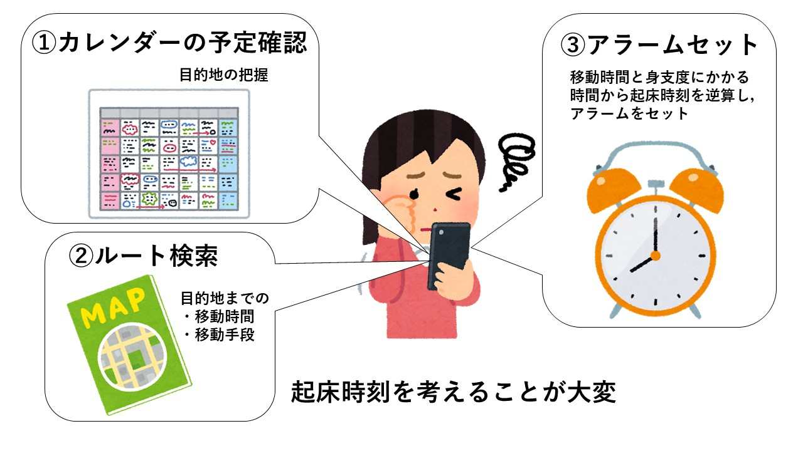
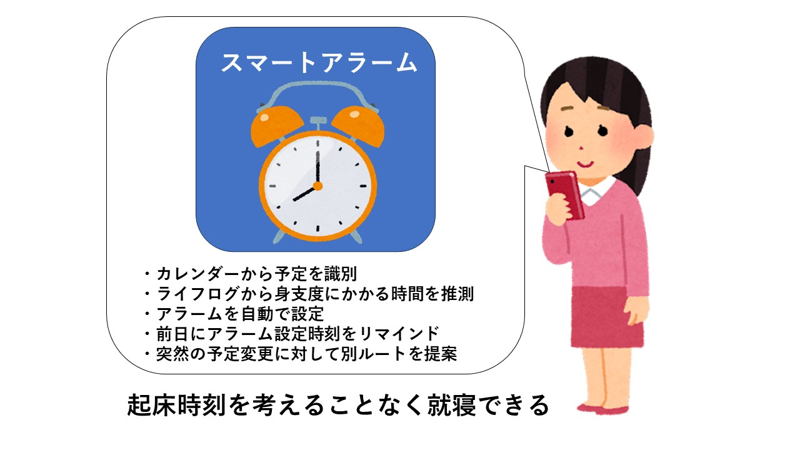

# Smart Alarm

## 1. システムの目的

このシステムの目的は、朝のルーチンを簡単にすることである。このアプリを使うことで、ユーザーは調べることなく、外出の準備をする時間を知ることができます。
従来、起床や身支度には手計算が必要だった。
設計したシステムでは、ユーザーのカレンダーをチェックし、朝のルーチンに基づいて自動的にアラームをセットする。また、目的地までの最適なルートを確認でき、時間割やタスクの登録、シームレスな管理が可能となる。また、翌日のスケジュールをプレビューして調整することも可能で、柔軟な対応が可能である。

## 2. システムの概要

　本システムは，就寝前のアラーム設定時刻登録にかかる一連の作業を，カレンダーに登録された情報をもとに自動で実行するWebアプリケーションとして構築する．

　下図(a)は，システム導入前の現状である．就寝前のアラームの設定は，カレンダーで翌日の予定を確認して，目的地にたどり着くまでのルートを検索し，その結果から起床時刻を逆算して，アラームを手動で設定する形になっている．ユーザーは，起床時刻を考えてアラームをセットするまでに労力を要していた．

図a. システム導入前の現状

　下図(b)は，システム導入後のあるべき姿である．Smart Alarmは，翌日の予定から身支度・移動に要する時間を推定し，必要となる時刻に自動でアラームをかけるWebアプリケーションとして実装される．ユーザは，自身のスマホやPCでアプリを開き，カレンダーに予定を登録することで翌日のアラームが望ましい時刻に設定される．システムは，既存のカレンダーアプリから予定を識別する機能，ライフログから身支度に要する時間を推測する機能，アラーム自動設定機能，前日のアラーム設定時刻リマインド機能，突然の予定変更に対する別ルート提案機能をもつ．

図b. システム導入による効果

　システムによって，ユーザは翌日のアラーム時刻設定を，システムのリマインド機能のみで行うことができるようになる．また，ユーザは起床時刻決定にかかる作業から解放され，他の創造的業務に従事する，または睡眠時間をより長く確保することができるようになる．

## 3. 機能一覧

- カレンダーとの連携機能

行動時間を算出するために、カレンダーアプリに入っている予定をシステムが認識する。

- 予定の確認機能
現在登録されている機能を確認する。

- 予定の登録機能

以前から決まっている予定を、新たにシステムに登録する。登録した予定に応じて、行動時間が変更される。

- 予定の突然の変更に対するリカバリ機能

電車に乗り遅れるなど突然予定が変更したとき、それに応じてリアルタイムで予定の変更を行う。

- 準備時間測定機能

普段のルーティンから家を出るまでの準備にかかる時間を測定する。また、徒歩などの移動にかかる時間を歩く速度を調べることで算出する。

- 明日の予定通知機能

前日に明日の予定確認の通知を行い、変更を可能にする。

- 道順を確認する
次の日の朝、目的地に向かうルートを自動で探索して表示する。この時、移動手段と移動方法を設定できるようにする。
