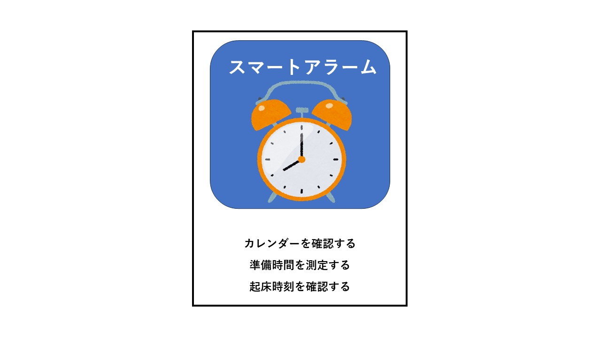
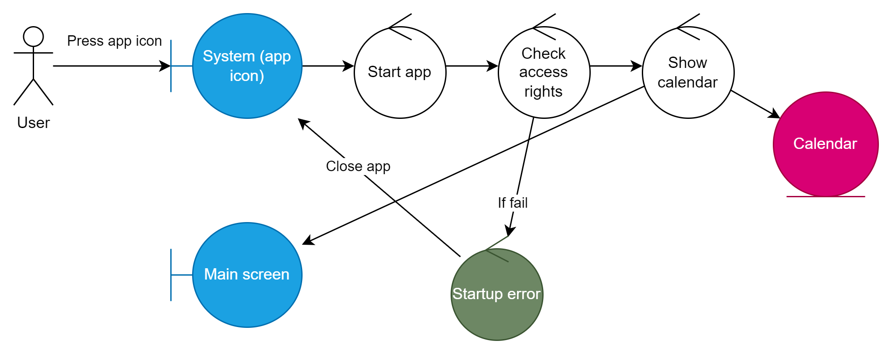
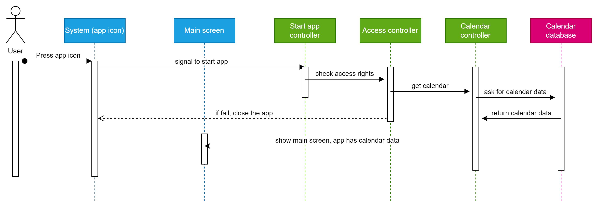

# ユースケース1: システムを起動する

## 概要

ユーザーがシステムを起動して、本システムの使用権限を取得する。

## アクター

- システムのユーザー

## 事前条件

- アプリを起動していないこと 

## 事後条件
ユーザーがシステムを起動した状態になる
システムにカレンダーが表示された状態になる
- 

## トリガー

- ユーザーがシステムのアイコンをクリックする 

## 基本フロー

1. システムはカレンダーを表示する

## 代替フロー

### 代替フロー1
- 1a.1システムの起動が何らかの原因で失敗した場合、アプリを閉じる

## GUI紙芝居

### 画面

## ロバストネス・ダイアグラム

## シーケンス図

