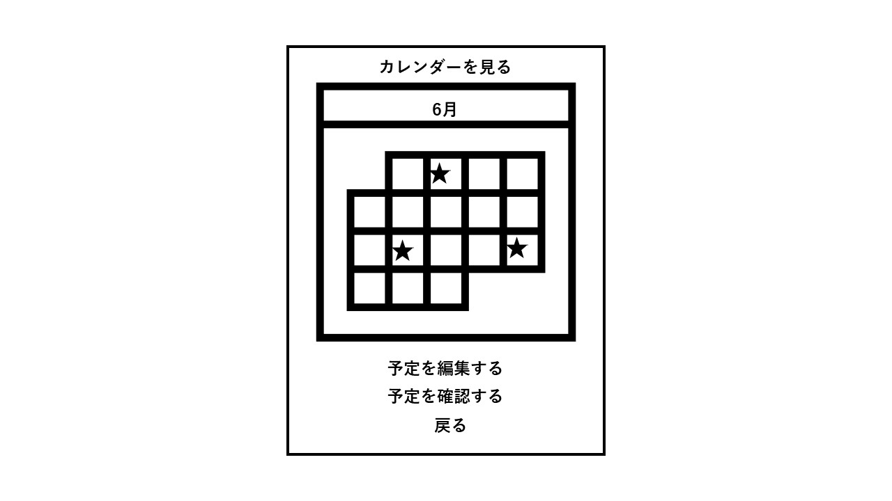

# ユースケース2: カレンダーに登録されている予定を確認する

## 概要
- ユーザーは寝る前に明日のカレンダー表示を確認することができます。

## アクター
- ユーザー

## 事前条件
- ユーザーがアプリを開いている
- ユーザーがカレンダーをアプリにリンクしている
- ユーザーが明日のスケジュールを確認したい

## 事後条件
- カレンダー画面がシステムに表示される

## トリガー
- ユーザーがメイン画面の「カレンダー表示」ボタンを押す

## 基本フロー
1. アプリ起動時 ユーザー自身のカレンダーアプリ（例：googleカレンダー）からカレンダーを取得。
2. メイン画面が表示される。(起床時刻を表示）
3. ユーザーが「カレンダー表示」ボタンを押す。
4. カレンダー画面が表示されます。
5. カレンダー画面でイベントや交通機関のスケジュールを確認できます。
(例：7:00起床、8:00出発、8:18神戸三宮行き特急に乗車、8:50大学到着）

## 代替フロー

### 代替フロー1
1a.1 自分のカレンダーがアプリと連動していない場合

1a.2 スケジュールを作成するために、アプリはカレンダーをリンクするか、新しいイベントを追加するように要求します。

## GUI紙芝居

### 画面

