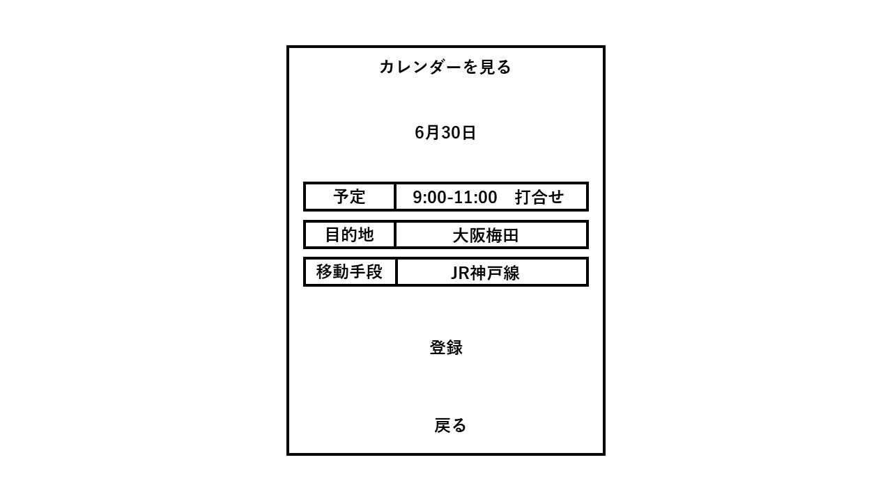
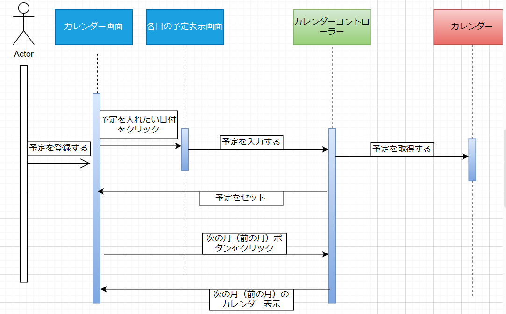

# ユースケース3: カレンダーに予定を登録する

# 概要

ユーザーがカレンダーを見て、予定を確認する

# アクター

- システムのユーザー

# 事前条件

- ユースケース２で，カレンダーがの「予定を編集する」がクリックされている

# 事後条件

- ユーザーがカレンダーの日ごとの予定(目的地、到着予定時刻、移動手段)を確認できる

# トリガー

- ユーザーがシステムを起動する

# 基本フロー

1. ユーザーはその日付の予定の目的地、時間、交通手段を入力する

2. ユーザーは「登録」をクリックする

3. システムは入力された予定をカレンダーに登録する

# 代替フロー

## 代替フロー1
- 3a.1 基本フロー1で、ユーザーが別の月の予定を見たい場合には、次の月(または前の月)をクリックする
- 3a.2 システムは当該月を次の月(または前の月)にセットし、２に戻る

# GUI紙芝居

## 予定登録画面

## シーケンス図

