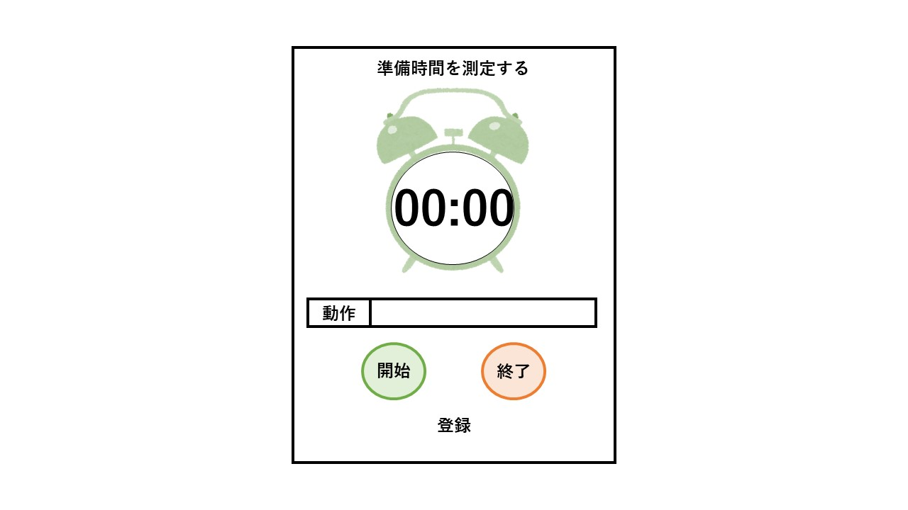
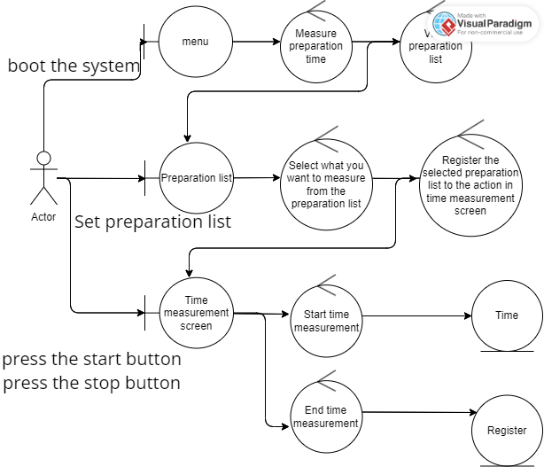

# ユースケース4: 各予定の準備時間を測定する

# 概要

ユーザーが各予定に対して普段要している時間を測定し，記録する．

# アクター

- ユーザー

# 事前条件

- スタート画面が表示されていること

# 事後条件

- 測定した予定の名称と，要した時間を表示する
- 測定した予定の所要時間として，このユースケースで測定した時間が設定される

# トリガー

- スタート画面の「準備時間を測定する」が押されたとき

# 基本フロー

1. ユーザーは，時間測定画面トップで「登録」を選択

2. システムは予定の種類一覧を表示する

3. ユーザーは，時間を測定したい予定の種類を確認し，入力する

4. システムは，時間を測定したい予定として設定された予定を，「動作：」の右側に追記する

5. ユーザーは，時間測定画面トップの「開始」ボタンを押す

6. システムは，時間計測を開始し，「開始」ボタンが押されてから経過した時間を表示する

7. ユーザーは，時間を測定したい予定が終了したら，時間計測画面の「終了」ボタンを押す

8. システムは，「開始」ボタンが押されてから「終了」ボタンが押されるまでの時間を記録

9. 3.で選択された予定に要する時間として，8.で記録した時間を設定し保存する

# 代替フロー

## 代替フロー1
- 2a.1 基本フロー2において，設定されている予定が一つもない場合は，「予定がありません」と表示し，時間測定画面トップに戻る．

## 代替フロー3
- 9a.1 基本フロー9においてすでに一度以上計測済みの予定について時間を計測した場合は，これまで計測した回数に1を足し，これまでの計測時間との平均をとって保存する

# GUI紙芝居

## 時間測定画面トップ

# ロバストネス図

[編集データ](https://online.visual-paradigm.com/share.jsp?id=323637313839362d33)

# シーケンス図

[編集データ](hhttps://online.visual-paradigm.com/share.jsp?id=323637313839362d34)

