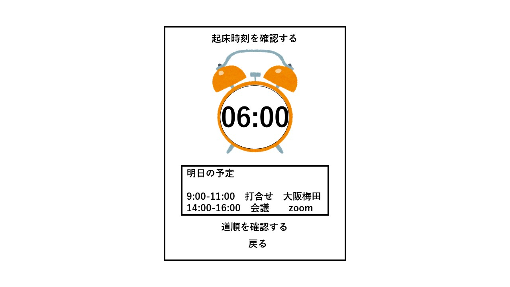

# ユースケース5: 予定の通知を確認する

# 概要

翌日に鳴らすアラームの設定時刻を，ユーザーに通知する．

# アクター

- ユーザー

# 事前条件

- カレンダーに予定が登録されていること
- アラーム時刻通知の設定がオンになっていること

# 事後条件

- アラーム設定時刻が確認される

# トリガー

- システムの時刻が，翌日のアラーム時刻の通知時間になること

# 基本フロー

1. システムは，翌日のアラーム時刻通知を表示する

2. ユーザーは，「OK」ボタンを押して通知を閉じる

# 代替フロー

## 代替フロー1
- 2a.1 基本フロー2において，ユーザーが「道順を確認する」を押した場合は，ユースケース6に移行する．

# GUI紙芝居

## アラーム設定時刻通知画面

