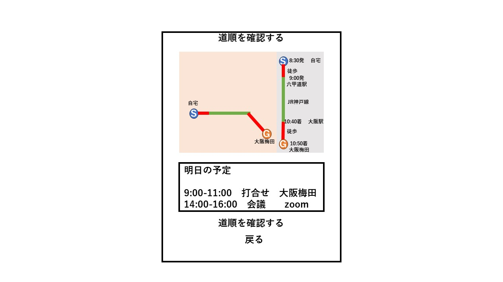
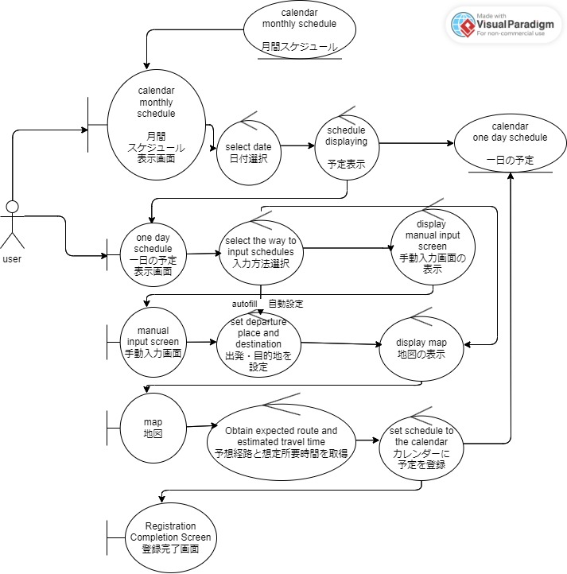

# ユースケース6: 目的地までの道順を確認する

# 概要

# アクター

- ユーザーは、明日の朝の目的地までの道順を確認し、変更することができます。

# 事前条件

- ユースケース5で「道順を確認する」が押されている

# 事後条件

- カレンダーに明日のタスクが設定されている

# トリガー

- 道順の変更、交通手段の変更などに伴い、朝のスケジュールが更新されます。

# 基本フロー

1. ユーザーがアプリ内のカレンダーから日付を選択する。

2. ユーザーがイベントの内容を設定するように求められる。

# 代替フロー

1. ユーザーは、アプリ内のカレンダーから編集したい日を選択します。

2. ユーザーは、手動入力を選択するか、地図を使用してルートを選択します。

3. システムは地図（例：Googleマップ）を表示し、出発地と終着地（存在する場合）を表示します。

4. システムは入力された出発地と目的地の情報を使用して、起床時間を計算します。

5. 変更が確認されると、このメニューは閉じます。

## 代替フロー1

- 1a.1 目的地が設定されていない場合、ユーザーに目的地が不足しているためアラームを設定できないという通知が表示されます。

# GUI紙芝居

## 道順表示

# ロバストネス図

[編集データ](https://online.visual-paradigm.com/share.jsp?id=323637313930352d31)

